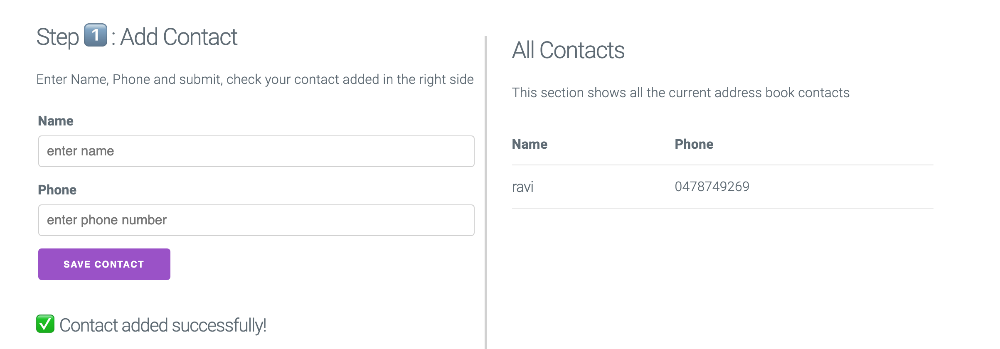
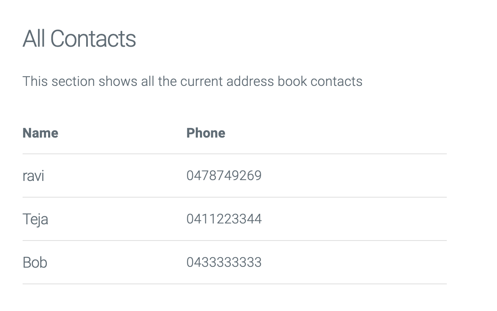
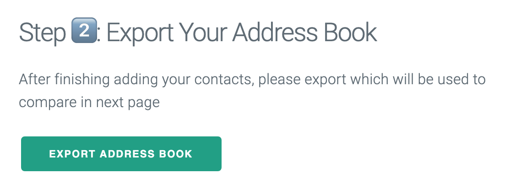
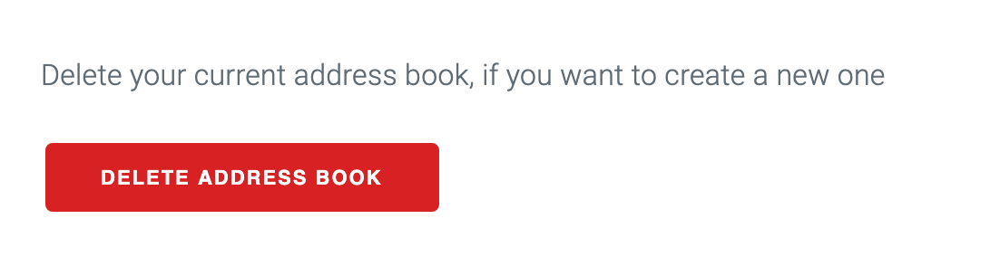
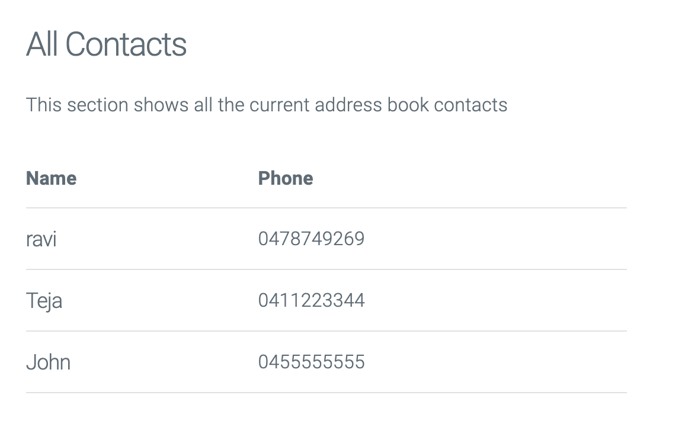
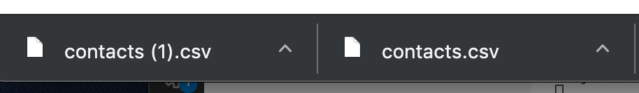
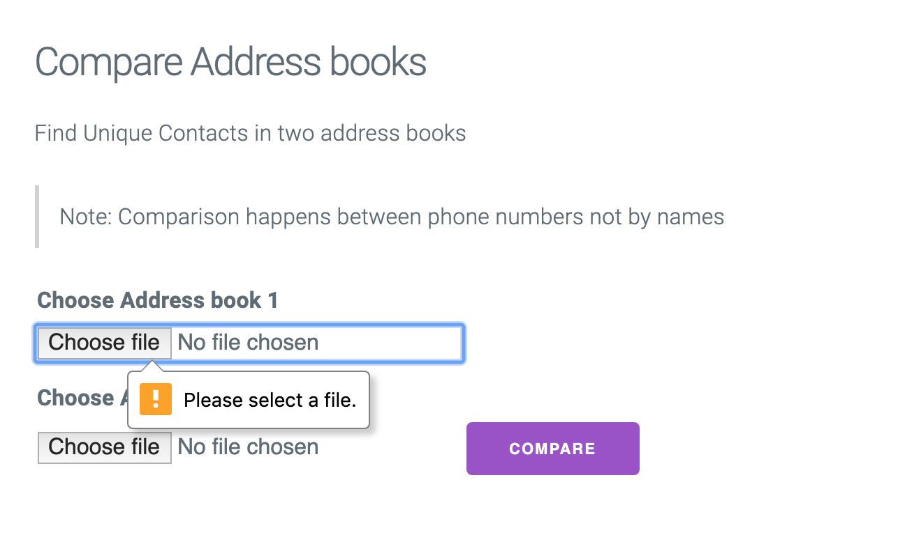
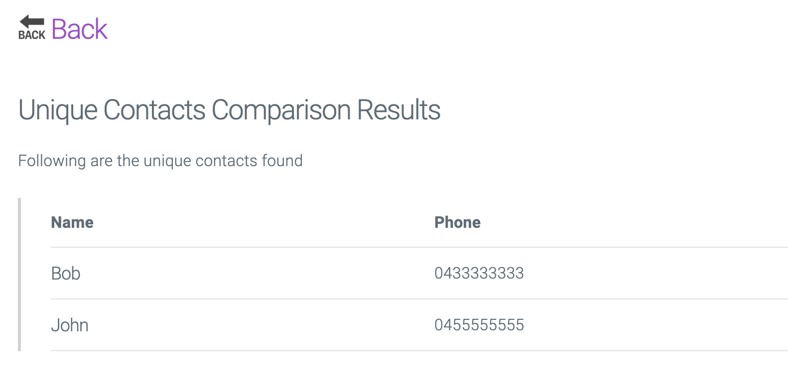
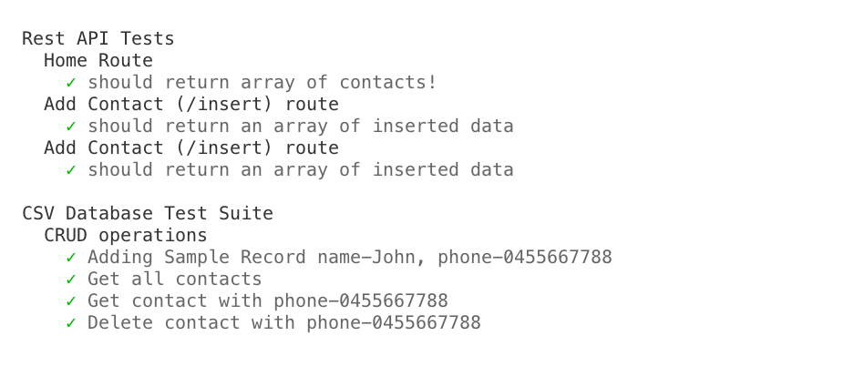

# PwC Address book - Code Challenge

Author: Ravi (kesanam.ravi@gmail.com)

## Setup

- ```npm install```
- ```npm start``` & open http://localhost:8080 in browser
- ```npm run test```

## How it works

- ExpressJS for routes
- NodeJS with CSV-Database for persisting database
- HandlebarJS for Templating
- Testing using mocha & expect.js

### REST API

- HOME = http://localhost:8080/

    - GET : All contacts ( HOME/api/ )
    - POST / GET : Insert Contact ( HOME/api/insert )
    - GET : Export Database ( HOME/api/export )
    - GET : Delete Database ( HOME/api/delete)

## Screenshots

### App Working

#### Step 1: Add Contacts to your address book


#### Step 2: Continue adding Contacts
For first address book, we added 3 contacts [ravi, teja, **Bob**].


#### Step 3: Export Address Book
When you are satisfied, click export


#### Step 4: Create Second(2nd) Address Book
Click Delete to create new Address Book 


#### Step 4b: You should have two address books exported by now
Now Repeat 1,2 & 3 ( Here we added [ravi, teja, **John**]) in 2nd address book.


#### Step 4c: You should have two address books exported by now


#### Step 5: Click Compare Now


#### Step 5b: Select previously downloaded files


#### Results



### Tests Screenshot

Unit & API Tests

